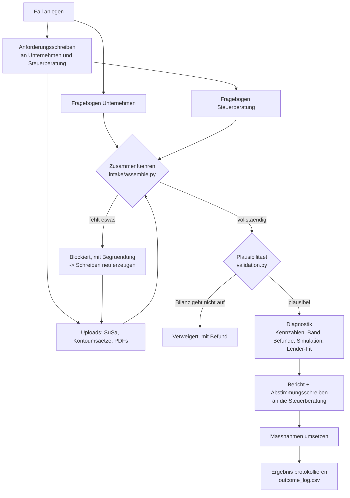

# Inputs, outputs and the engagement process

This document describes everything an engagement takes in, everything it produces,
and the rules that connect the two. The definitions themselves live in code
(`src/credit_readiness/intake/`), and the printable versions in
[docs/intake/](intake/) are generated from that code, so this page and the forms
cannot drift apart.

## The process

Case stages, as shown in the portal: *Neu angelegt -> Unterlagen angefordert ->
Unterlagen vollstaendig -> Diagnostik erstellt -> Massnahmen in Umsetzung ->
Beim Kreditgeber -> Abgeschlossen.*

## Inputs

### 1. Fragebogen Unternehmen (41 Fragen, 6 Abschnitte)

Captures what no trial balance shows. Printable: [Fragebogen_Unternehmen.html](intake/Fragebogen_Unternehmen.html);
blank answer file: [Fragebogen_Unternehmen_Antwortvorlage.json](intake/Fragebogen_Unternehmen_Antwortvorlage.json).

| Abschnitt | What it establishes | Feeds |
|---|---|---|
| Unternehmen | name, legal form, sector, size, age | profile, sector benchmark, size class |
| Finanzierungsvorhaben | amount, purpose, term, collateral, urgency, prior rejection | debt service incl. new loan (DSCR), lender routing, collateral-gap rule R07 |
| Bestehende Finanzierungen | every loan and overdraft line; limit and utilisation; days at the limit | Kapitaldienst, overdraft rule R04 |
| Gesellschafter | shareholder loans, Rangruecktritt | economic equity, rule R01 |
| Reporting und Zahlungsverhalten | BWA cadence and age, forecast, payment delays, tax arrears, Creditreform index | behavioural factors, rules R02, R03, R09 |
| Einwilligungen und Kontakt | GDPR consent, permission to contact the Steuerberater | **no consent -> no analysis** |

### 2. Fragebogen Steuerberatung (20 Fragen, 4 Abschnitte)

Confirms the accounting facts with professional responsibility behind them.
Printable: [Fragebogen_Steuerberater.html](intake/Fragebogen_Steuerberater.html).

| Abschnitt | What it establishes |
|---|---|
| Kanzlei | contact |
| Buchhaltung und Abschluss | chart of accounts (SKR04 is read automatically; SKR03 is refused, not guessed), closing status, BWA cadence |
| Bestaetigungen | Rangruecktritt, tax arrears, deferral agreement, forecast |
| Sondereffekte | one-off items, accounting choices, known risks: reported as notes, **never** adjusted into the ratios |

### 3. Documents

Full list with reasons: [Unterlagenliste.html](intake/Unterlagenliste.html).

| Document | From | Required | Format | Read automatically? |
|---|---|---|---|---|
| Summen- und Saldenliste, current year | Steuerberatung | yes | CSV (DATEV, SKR04) | **yes**: all balance-sheet and P&L figures |
| Summen- und Saldenliste, prior year | Steuerberatung | recommended | CSV | **yes**: trend (revenue growth) |
| Kontoumsaetze, 6-12 months | Unternehmen | recommended | CSV (any German bank export) | **yes**: days at the overdraft limit, returned direct debits |
| Aktuelle BWA | Steuerberatung | yes | PDF/CSV | no, filed for the advisor |
| Jahresabschluesse, 2-3 years | Steuerberatung | yes (min. 2) | PDF | no |
| Handelsregisterauszug | Unternehmen | yes | PDF | no |
| Kredit- und Leasingvertraege | Unternehmen | if loans are declared | PDF | no |
| Rangruecktrittserklaerung | Unternehmen | if a Rangruecktritt is declared | PDF | no |
| Planrechnung | Steuerberatung | from EUR 100.000 requested | PDF/XLSX/CSV | no |
| Stundungsvereinbarung | Steuerberatung | if tax arrears exist | PDF | no |
| Steuerkontoauszug | Steuerberatung | recommended | PDF | no |
| Creditreform-Auskunft | we obtain it | recommended | PDF | no (index is entered in the questionnaire) |
| Sicherheitenaufstellung, Gesellschafterliste | Unternehmen | optional | PDF | no |

**Why PDFs are never read automatically.** OCR on a scanned balance sheet
produces confident, wrong numbers, which is the one failure mode this business
cannot afford. PDFs count towards completeness and go into the lender package;
numbers come only from structured exports.

#### DATEV SuSa format

Semicolon-separated CSV with at least the columns `Konto` and `Saldo` (one signed
balance, credit balances negative). German number format (`1.234.567,89`),
UTF-8 or Windows-1252. Each upload must state its **Stichtag** and **period in
months** (1-12). A mid-year SuSa is annualised automatically. If more than 5 % of
the volume cannot be mapped to SKR04 ranges, the upload is rejected with the list
of unknown accounts.

#### Bank CSV format

Any German online-banking export. The parser finds the header itself (lines above it
are skipped), sniffs `;` `,` or tab, accepts a signed `Betrag` column or separate
`Soll`/`Haben` columns, and handles newest-first or oldest-first order. A `Saldo`
column is needed to count days at the limit; without it that figure is reported
as unavailable, not guessed.

## Rules connecting inputs to the case

**Precedence** when several sources state the same fact:

> observed (bank statement) > Steuerberater confirmation > client self-report

Every such choice is recorded and printed in section 9 of the report
("Datengrundlage"), including disagreements: e.g. *"Tage am Kontokorrentlimit:
Selbstauskunft 40, laut Kontoumsaetzen 71. Verwendet werden die Kontoumsaetze."*

**What blocks a diagnostic** (the portal lists the reasons):
- no GDPR consent
- any diagnosis-critical answer missing (company, legal form, sector, size, founding year,
  amount, purpose, shareholder loans yes/no, tax arrears, BWA cadence and date)
- no current SuSa, or a SuSa without Stichtag
- chart of accounts other than SKR04
- input that fails plausibility: a balance sheet that does not balance, or a P&L
  result that differs from the profit line in equity

**What never happens silently:**
- a shareholder loan mentioned by the client but missing from the SuSa is **flagged, not added** (adding it would unbalance the sheet)
- one-off items named by the Steuerberater are **reported, not adjusted**
- a missing overdraft limit leaves the overdraft factor **out** (visibly), rather than assuming a value

## Outputs

All written per case to `data/clients/<Fall-ID>/artifacts/` and viewable in the portal.

| Output | File | For whom |
|---|---|---|
| Diagnostic report | `diagnostik.html` (print / save as PDF), `diagnostik.md` | client and Steuerberater |
| Result summary | `summary.json` | portal, outcome log, later a CRM/database |
| Assembled case | `case.json` | reproducibility: the exact input the engine saw |
| Data basis | `assembly.json` | provenance, parsed sources, notes |
| Document request to the client | `anforderung_unternehmen.html/.md` | client |
| Request to the Steuerberater | `anforderung_steuerberater.html/.md` | Steuerberater |
| Sign-off letter | `abstimmung_steuerberater.html/.md` | Steuerberater (and lawyer where flagged) |
| Outcome log | `data/clients/outcome_log.csv` | the business: the proprietary dataset |

The report contains: result at a glance (readiness band, indicative score,
classification), all ratios with their scores, the weaknesses ranked by points
lost, each finding with remediation and caveats, the simulated before/after,
lender-type fit now and after remediation, sector comparison, next steps, and the
data basis. It carries the "not a rating" disclaimer twice.

## Where things are stored

`data/clients/` is excluded from git. It is a local folder. Before hosting, the
`CaseStore` interface in `src/credit_readiness/casefile.py` is implemented against
the database and object storage, and nothing else changes. See
[regulatory-guardrails.md](regulatory-guardrails.md) for what hosting requires.
